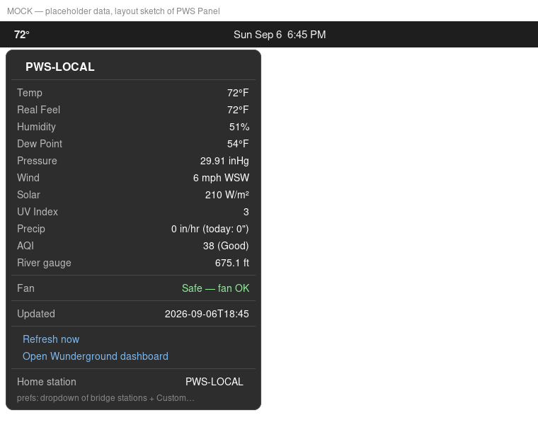

# PWS Panel — GNOME Shell Extension

Live weather from your personal weather station (PWS) in the GNOME top bar.



## What it does

- **Top bar button** (left of the clock): current temp + condition emoji — `72° ☁️`
- **Dropdown menu**: temperature, real feel (heat index / wind chill), humidity, dew point, pressure, wind, solar radiation, UV index, precipitation, AQI (PM2.5), optional river/dam gauge row, whole-house-fan verdict, last-updated timestamp
- **🔄 Refresh now** + **🌐 Open Wunderground dashboard** (opens *your* station) in the menu
- **Home station dropdown** in preferences: pick from bridge-served stations or enter a custom ID — no hardcoding, no reinstall
- **Auto station mode**: uses Geoclue location to pick the *nearest* PWS when you're on the road, with a home geofence that pins your home station when you're within range
- **Full settings** via the Extensions app gear icon

## Architecture

Two pieces bridged over localhost:

```
┌─────────────────────┐     HTTP 127.0.0.1:8766     ┌──────────────────────────┐
│  GNOME Extension    │  ─────────────────────────▶ │  pws-bridge (Python)     │
│  (GJS, ESM)         │  ◀───────────────────────── │  fetches Weather.com     │
└─────────────────────┘        JSON payload         │  + AQI, caches 10 min    │
                                                    └──────────────────────────┘
```

- **`bridge/pws-bridge.py`** — pure-stdlib Python HTTP server on port 8766. Serves `/pws`, `/pws?station=…`, `/pws?lat=&lon=&home-lat=&home-lon=&home-radius=` and `/health`. Reuses `pws_fetcher.py` + `aqi_fetcher.py`.
- **`extension/`** — GJS ES-module extension (`pws-panel@fedora`), `PanelMenu.Button` subclass, Soup3 for HTTP, GSettings schema, `ExtensionPreferences`-class settings window.
- **`systemd/pws-bridge.service`** — user unit that keeps the bridge alive.
- **`install.sh`** — one-command install: copies files, installs/restarts the service, compiles the schema, enables the extension.

### Auto station mode (geofence)

1. Extension asks **Geoclue** for your coordinates
2. Bridge computes **haversine distance** to home (set your own home station + coords in preferences)
3. Inside the radius → home station. Outside → resolves nearest PWS via Weather.com's v3 `location/point` endpoint (`pwsId`)
4. Silent/offline station → falls back to home station

## Requirements

- GNOME Shell **50** (tested on 50.4, Fedora)
- Python 3.10+ (bridge, stdlib only)
- A Weather Underground **API key** — set `PWS_API_KEY` (see Configuration); the bridge refuses to start without it
- A local PWS station ID (find yours on wunderground.com/wundermap and set it in preferences, or via `PWS_HOME_STATION`)

## Install

```bash
curl -fsSL https://github.com/GusBot69/pws-panel/raw/main/install.sh | bash
```

Or download the repo and run `bash install.sh` from the project root.

## Configuration

All location-specific values are environment variables on the bridge service — nothing personal ships in the repo. Create an override after installing:

```bash
mkdir -p ~/.config/systemd/user/pws-bridge.service.d && cat > ~/.config/systemd/user/pws-bridge.service.d/10-local.conf <<'EOF'
[Service]
Environment=PWS_API_KEY=your-wunderground-key
Environment=PWS_HOME_STATION=YOURPRIMARY
Environment=PWS_WIND_STATION=YOURFALLBACK
Environment=PWS_AQI_URL=https://aqicn.org/city/your-region/your-city/
# Optional river/dam gauge row (scraped level + gates, omit if you have none):
Environment=PWS_RIVER_URL=https://your-county.example/gauge-page
Environment=PWS_RIVER_LABEL=Local River
EOF
systemctl --user daemon-reload && systemctl --user restart pws-bridge
```

| Variable | Required | Purpose |
|---|---|---|
| `PWS_API_KEY` | yes | Weather Underground key — bridge exits(2) without it |
| `PWS_HOME_STATION` | yes | Primary PWS (full sensor suite), e.g. home mode + `/stations` list |
| `PWS_WIND_STATION` | no | Fallback with anemometer (wind/solar/UV fill-in; never precip) |
| `PWS_AQI_URL` | no | Full aqicn.org city URL for the AQI row |
| `PWS_RIVER_URL` / `PWS_RIVER_LABEL` | no | Gauge page + menu label; row hidden when unset |

## Settings

Opened via the gear icon in the Extensions app:

| Setting | Default | Purpose |
|---|---|---|
| Station mode | `home` | `home` = always home station; `auto` = geofence + nearest |
| Home station ID | *(yours)* | Station used in home mode and as fallback |
| Home latitude / longitude | 0.0 / 0.0 | Geofence center — set your own |
| Home geofence radius (km) | 5.0 | Distance inside which home station is used |
| Poll interval (s) | 900 | How often the extension refetches |
| Show temperature | on | Hide to show only the condition emoji |

## Development

- Extension source: `~/projects/pws-panel` (Beelink)
- Deploy: rebuild tarball + re-run `install.sh` on target (or `git clone` + `install.sh` directly)
- After changing the extension: log out/in (GNOME 50 removed Alt+F2 `r` on Wayland)

### Known pitfalls (all documented in the wiki page)

GJS extension development on GNOME 45+ has several traps that each cost a debug cycle:

- Subclasses of GObject classes must use `GObject.registerClass` + `_init()` — a plain ES class with `constructor()` throws *"Tried to construct an object without a GType"*
- Don't name methods after parent internals (`setMenu` collides with `PanelMenu.Button`'s own)
- Use **Soup3**, not `fetch()`, for HTTP in extensions
- gschema XML wants `<range min="" max=""/>`, not `<min>/<max>` children — and `glib-compile-schemas` exits 0 even on failure
- The Extensions app registers **no** `gnome-extensions://` URI handler — settings open via the gear icon only
- `systemctl enable --now` does not restart a running service — always `systemctl restart` after installing new bridge code

## License

MIT
